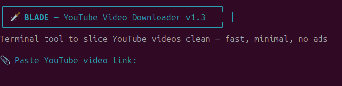
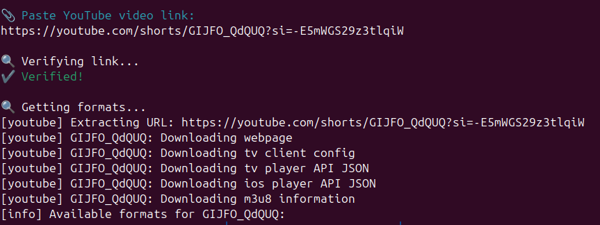
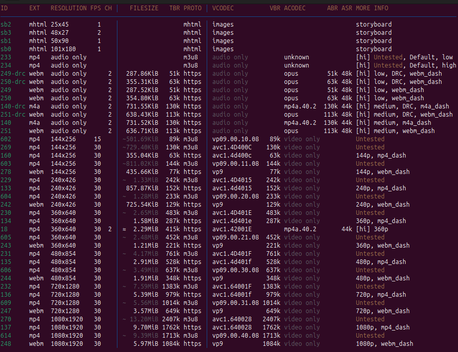
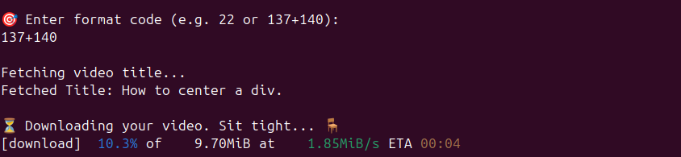
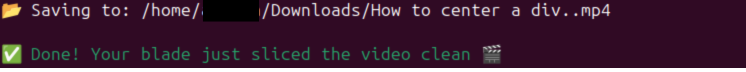

# 🗡️ Blade — YouTube Video Downloader

> Slice YouTube videos clean, fast & ad-free — right from your terminal.

Blade is a beginner-friendly CLI tool designed for Linux users who want to download YouTube videos easily using just a command-line interface — no need to remember long yt-dlp commands.

🎬 Whether you're a non-tech user or a minimalist, Blade gives you full control over video format selection, title auto-detection, and error handling in one clean Bash script.

## ✨ Features

- 🗡️ **Minimal & Fast** — No fluff, no ads, just clean downloads
- 📦 **Works in Terminal** — Zero GUI needed. Perfect for devs & power users
- 🎯 **Custom Format Selection** — Choose exactly what quality to download
- 🎥 **Auto Video Title Detection** — Saves videos with proper titles
- 💾 **Auto-Save to Downloads** — Files go straight to your ~/Downloads
- 🚫 **No Bloat** — No tracking, no extra dependencies

## 🛠️ Installation (Linux Only)

Follow these steps to get Blade running on your system:

### 1. 📥 Clone the Repository

```bash
git clone https://github.com/zorointerminal/Blade.git
cd Blade
```

### 2. ✅ Make the Script Executable

```bash
chmod +x blade.sh
```

### 3. ⚙️ (Optional) Set as Global Command

To use blade from anywhere in terminal:

```bash
sudo cp blade.sh /usr/local/bin/blade
```

Now just type `blade` from anywhere!

### ⚠️ Dependencies

Make sure these tools are installed:

```bash
sudo apt update
sudo apt install yt-dlp ffmpeg
```

### 🧪 Test It!

```bash
blade
```

## 📖 How to Use

1. **Start Blade** — Run `blade` in your terminal
2. **Enter YouTube URL** — Paste the video link when prompted
3. **Choose Format** — Select from available quality options (e.g., `137+140` for 1080p video + audio)
4. **Download** — Blade will download and save the video to ~/Downloads

## 📸 Demo

Here's how Blade works — minimal, fast, and clean:

### 🔹 1. Start & Verify



### 🔹 2. Available Formats

**Step 1: Blade shows available formats with video/audio quality details**



**Step 2: You can pick format code like `137+140` (video + audio)**



### 🔹 3. Downloading...



### 🔹 4. Done!



## 🧠 FAQ / Troubleshooting

**Q: It says yt-dlp or ffmpeg not found?**
> Run this in your terminal:
> ```bash
> sudo apt install yt-dlp ffmpeg
> ```

**Q: It shows DRM error or 'not supported'?**
> Blade supports only YouTube videos currently. DRM-protected sites like Netflix, Spotify, etc. are not supported.

**Q: Where is my video saved?**
> Videos are auto-saved to: `~/Downloads/<YouTubeTitle>.mp4`

**Q: Getting 'invalid format code'?**
> Make sure you're entering something like `22` or `137+140`. These are shown in the format list Blade displays.

## 🤝 Contributing

Contributions are welcome! Please feel free to submit a Pull Request. For major changes, please open an issue first to discuss what you would like to change.

## 📜 License

Blade is licensed under the [MIT License](LICENSE). You are free to use, modify, and distribute this tool.

## 💬 Feedback & Suggestions

Loved Blade? Got ideas for improvements? Reach out here:

**X (formerly Twitter):** [@zorointerminal](https://x.com/zorointerminal)

---

<div align="center">
<strong>Made with ❤️ for the Linux community</strong>
</div>